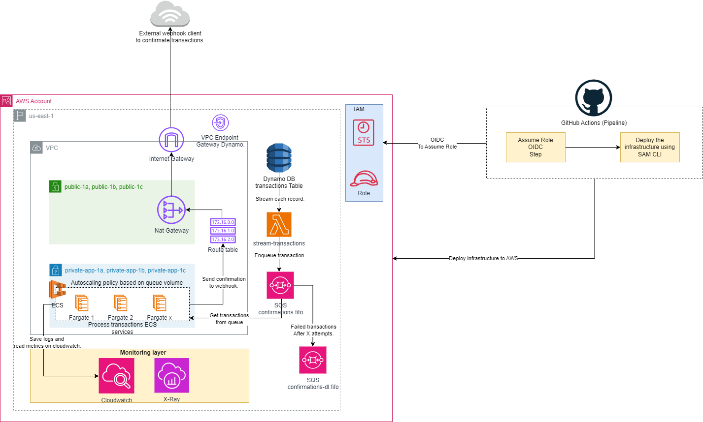

# Prueba Jr. DevOps ePayco

### En esta prueba se encuentran dos propuestas de soluciones para el siguiente problema: 

##### Una empresa de pagos tiene un sistema de confirmaciones basado en crones la cual se ha convertido en un dolor de cabeza, ya que necesita confirmar muchas transacciones a sus clientes con un promedio de 2,000 transacciones por segundo, en este momento solo puede confirmar 5 por segundo.

### La propuesta número 1:

##### Esta arquitectura fue realizada con AWS Application Composer el cual nos crea una plantilla de AWS CloudFormation que está diseñada para implementar una solución serverless en Amazon Web Services (AWS). La solución se centra en la gestión de confirmaciones de transacciones para una empresa de pagos y aborda un desafío particular: la necesidad de confirmar un gran número de transacciones a clientes a una alta velocidad.

### Componentes Clave:

##### La plantilla incluye varios recursos y componentes esenciales que trabajan en conjunto para gestionar las confirmaciones de transacciones de manera eficiente:

### Funciones Lambda:

##### - InsertDataFakeTransactions: Una función Lambda que almacena datos de confirmaciones en una tabla DynamoDB.
##### - ConfirmationTransactions: Otra función Lambda que procesa eventos de una tabla DynamoDB y envía confirmaciones al cliente.
##### - ConfirmationWebhook: Una función Lambda que responde a las solicitudes del cliente a través de una API REST.

### DynamoDB Table (Transactions):

##### Una tabla de DynamoDB llamada "Transactions" que almacena datos de transacciones con atributos específicos y un modelo de facturación basado en solicitudes.
### Registro de Eventos (CloudWatch Logs):

##### Se crean grupos de registro para cada función Lambda para la gestión y monitorización de registros.
### API Gateway:

##### Una API de Gateway de API que expone una ruta /confirmation para recibir solicitudes de clientes y enrutarlas a la función ConfirmationWebhook.
### Características Clave:

##### - Uso de funciones Lambda serverless para gestionar transacciones y confirmaciones.
##### - Utilización de una tabla DynamoDB con un modelo de facturación basado en solicitudes.
##### - Integración con una API de Gateway de API para gestionar las solicitudes de los clientes.
##### - Monitorización y registro de eventos a través de CloudWatch Logs.
### Beneficios:

##### Escalabilidad: La solución es altamente escalable y puede manejar un alto volumen de transacciones.
##### Costo Eficiente: El modelo de facturación basado en solicitudes de DynamoDB puede ayudar a controlar los costos.
##### Facilidad de Mantenimiento: La arquitectura serverless simplifica el mantenimiento de la infraestructura.

### La propuesta número 2:

##### En este escenario, propongo una solución para abordar el problema de procesamiento de transacciones de manera asincrónica y altamente desacoplada, aprovechando un sistema de colas gestionado por AWS, específicamente SQS FIFO. Los objetivos son los siguientes:

### Flujo de Datos desde DynamoDB a SQS:

##### - Una vez que las transacciones se insertan en la tabla de DynamoDB, se configura un flujo de datos mediante streams. Este flujo se dirige hacia una función Lambda llamada "stream-transactions".
##### - La función Lambda recibe los datos del stream y, de manera inmediata, utiliza el SDK para encolar cada transacción en una cola SQS de tipo FIFO.
### Servicio en ECS para Procesamiento Ordenado:

##### - Con el uso de un servicio en Elastic Container Service (ECS) para procesar los mensajes en la cola en el orden en que llegan. Recomiendo que este servicio ECS se ejecute en un entorno Fargate para optimizar costos.
##### - Este servicio está configurado con políticas de escalado automático basadas en métricas que miden la cantidad de mensajes en la cola. Cuando se acumulan muchas transacciones, el servicio escala horizontalmente al aumentar el número de tareas, lo que permite un procesamiento rápido y eficiente. En contraste, cuando el flujo de transacciones disminuye, el servicio reduce el número de tareas para mantener un procesamiento eficiente y sin problemas.
### Procesamiento y Actualización en la Base de Datos:

##### - Las tareas que se ejecutan en el servicio Fargate se encargan de realizar llamadas a URLs de webhooks de confirmación. Cuando obtienen una respuesta exitosa (código 200), actualizan el registro en la base de datos para evitar futuras confirmaciones y eliminan el mensaje de la cola SQS.
### Manejo de Errores y Cola de Fallos:

##### - Si, por alguna razón, el servicio falla al llamar el webhook, el mensaje no se elimina de la cola. En su lugar, se mantiene en la cola y se reintenta según la configuración de reintentos de la cola.
##### - Si después de varios reintentos el mensaje no se confirma, se mueve a la cola "confirmations-dl.fifo", que es la cola de fallos. Esta cola debe monitorearse de manera continua para evaluar las posibles causas de la falta de confirmación.
### Monitoreo y Observabilidad:

##### - Todos los servicios generarán información relevante y métricas que se almacenarán en grupos de CloudWatch, lo que nos proporcionará una capa sólida de observabilidad.
##### - Se recomienda implementar AWS X-Ray como una capa adicional en el monitoreo para poder rastrear y analizar todos los "traces". Esto permite identificar problemas en la comunicación entre servicios, medir los tiempos de respuesta y obtener una vista más amplia que facilita la resolución eficiente y oportuna de posibles errores.

