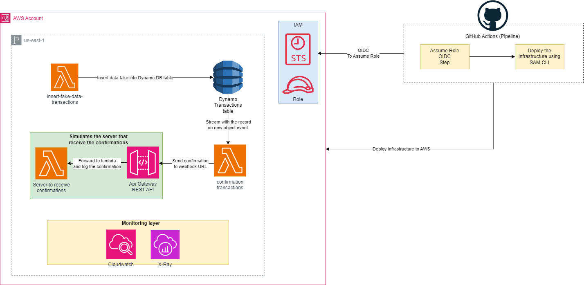

# Prueba Jr. DevOps ePayco

### En esta prueba se encuentran dos propuestas de soluciones para el siguiente problema: 

##### Una empresa de pagos tiene un sistema de confirmaciones basado en crones la cual se ha convertido en un dolor de cabeza, ya que necesita confirmar muchas transacciones a sus clientes con un promedio de 2,000 transacciones por segundo, en este momento solo puede confirmar 5 por segundo.

### La propuesta número 1:

##### Esta arquitectura fue realizada con AWS Application Composer el cual nos crea una plantilla de AWS CloudFormation que está diseñada para implementar una solución serverless en Amazon Web Services (AWS). La solución se centra en la gestión de confirmaciones de transacciones para una empresa de pagos y aborda un desafío particular: la necesidad de confirmar un gran número de transacciones a clientes a una alta velocidad.

### Componentes Clave:

##### La plantilla incluye varios recursos y componentes esenciales que trabajan en conjunto para gestionar las confirmaciones de transacciones de manera eficiente:

### Funciones Lambda:

##### - InsertDataFakeTransactions: Una función Lambda que almacena datos de confirmaciones en una tabla DynamoDB.
##### - ConfirmationTransactions: Otra función Lambda que procesa eventos de una tabla DynamoDB y envía confirmaciones al cliente.
##### - ConfirmationWebhook: Una función Lambda que responde a las solicitudes del cliente a través de una API REST.

### DynamoDB Table (Transactions):

##### Una tabla de DynamoDB llamada "Transactions" que almacena datos de transacciones con atributos específicos y un modelo de facturación basado en solicitudes.
### Registro de Eventos (CloudWatch Logs):

##### Se crean grupos de registro para cada función Lambda para la gestión y monitorización de registros.
### API Gateway:

##### Una API de Gateway de API que expone una ruta /confirmation para recibir solicitudes de clientes y enrutarlas a la función ConfirmationWebhook.
### Características Clave:

##### - Uso de funciones Lambda serverless para gestionar transacciones y confirmaciones.
##### - Utilización de una tabla DynamoDB con un modelo de facturación basado en solicitudes.
##### - Integración con una API de Gateway de API para gestionar las solicitudes de los clientes.
##### - Monitorización y registro de eventos a través de CloudWatch Logs.
### Beneficios:

##### Escalabilidad: La solución es altamente escalable y puede manejar un alto volumen de transacciones.
##### Costo Eficiente: El modelo de facturación basado en solicitudes de DynamoDB puede ayudar a controlar los costos.
##### Facilidad de Mantenimiento: La arquitectura serverless simplifica el mantenimiento de la infraestructura.
